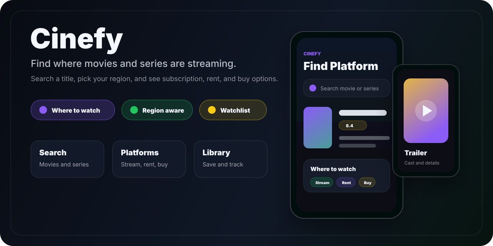
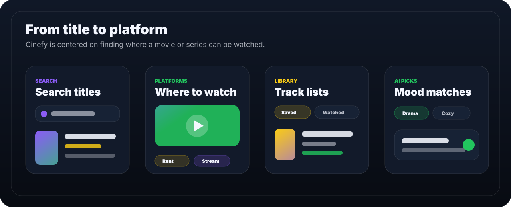

# Cinefy



Cinefy helps users answer the question that usually takes too many tabs: **"Which platform has this movie or TV show?"**

It is a polished Expo / React Native app for searching movies and series, checking streaming availability by region, and seeing whether a title is available by subscription, rental, or purchase. Discovery, favorites, watchlist, watched status, trailers, cast details, and optional AI recommendations support the main goal: getting from "what should I watch?" to "where can I watch it?" quickly.

## Highlights



- Find where movies and TV shows are streaming by region.
- See provider availability grouped by subscription, rental, and purchase options.
- Search movies and TV shows with a smooth debounced search experience.
- Browse trending movies and TV titles when the search field is empty.
- Open rich detail pages with posters, backdrop art, overview, genres, cast, runtime, seasons, rating, and trailers.
- Save favorites, add titles to a watchlist, or mark them as watched.
- Get AI-powered recommendations by media type, genre, and mood.
- Keep preferences such as provider region in local storage.
- Use a mobile-first dark UI built with Expo Router and TypeScript.

## Screens

| Find Platforms | Details | Library | AI Picks |
| --- | --- | --- | --- |
| Search titles and see where to watch | Trailer, cast, provider options | Favorites, watchlist, watched | Genre and mood-based recommendations |

## Tech Stack

- Expo 54 and React Native 0.81
- Expo Router
- TypeScript
- TMDB API
- OpenAI Responses API for AI recommendations
- AsyncStorage for favorites, watchlist, and settings
- Express server for the AI recommendation endpoint

## Project Structure

```text
app/
  (tabs)/
    index.tsx        # Search and streaming discovery tab
    favorites.tsx    # Library: favorites, watchlist, watched
    explore.tsx      # AI recommendation tab
  detail.tsx         # Movie/TV detail screen with provider availability
server/
  index.js           # Local AI recommendation API
src/
  api/               # TMDB client
  i18n/              # Turkish/English UI strings
  storage/           # AsyncStorage helpers
  ui/                # Shared theme
```

## Getting Started

Install dependencies:

```bash
npm install
```

Create a `.env` file in the project root:

```bash
EXPO_PUBLIC_TMDB_API_KEY=your_tmdb_api_key_or_read_access_token_here
EXPO_PUBLIC_AI_API_BASE=http://localhost:3000
OPENAI_API_KEY=your_openai_api_key_here
OPENAI_MODEL=gpt-5.2
```

Start the Expo app:

```bash
npm run web
```

For native development:

```bash
npm run android
npm run ios
```

Start the recommendation server in a separate terminal:

```bash
cd server
npm install
npm start
```

## AI Recommendations

The Explore tab sends the selected media type, genre, and mood to the local Express server. The server pulls TMDB candidates, asks OpenAI to choose exactly five matches, then returns normalized recommendations that link back into the app detail screen.

If `OPENAI_API_KEY` is missing or the server is not running, the search, provider lookup, details, favorites, watchlist, and watched features still work.

## Environment Variables

| Variable | Required | Description |
| --- | --- | --- |
| `EXPO_PUBLIC_TMDB_API_KEY` | Yes | TMDB API key or read access token used by the app. |
| `EXPO_PUBLIC_AI_API_BASE` | For AI tab | Base URL of the local recommendation server. |
| `OPENAI_API_KEY` | For AI server | OpenAI API key used by `server/index.js`. |
| `OPENAI_MODEL` | Optional | Model for recommendations. Defaults to `gpt-5.2`. |

## Scripts

```bash
npm run web       # Start Expo for web
npm run android   # Run Android app
npm run ios       # Run iOS app
npm run lint      # Run Expo lint
```

## Roadmap Ideas

- Add real screenshot captures for each screen.
- Add ratings and notes for watched titles.
- Add provider filters to make streaming lookup even faster.
- Add similar titles on the detail page.
- Add export/share support for watchlists.

## Credits

Movie and TV metadata is powered by [TMDB](https://www.themoviedb.org/). AI recommendations are powered by the OpenAI API when the local recommendation server is configured.
